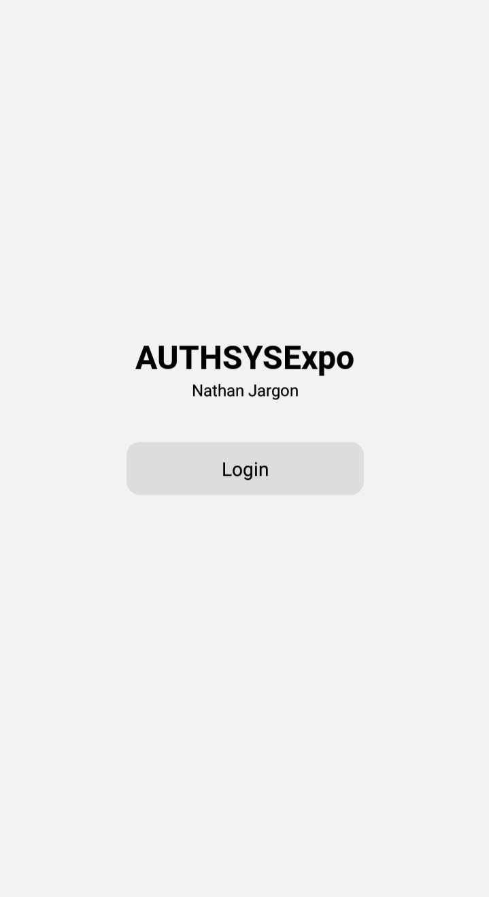

# 🚀 AUTHSYSExpo

  

This is a simple authentication system built with Expo and Google Cloud. It uses the `expo-auth-session` package for OAuth flows and Google Cloud for user authentication.

## 📋 Prerequisites

- Node.js
- Expo CLI
- A Google Cloud account

## 🛠️ Installation

1. Clone the repo: `git clone https://github.com/yourusername/AUTHSYSExpo.git`
2. Install NPM packages: `npm install` or `yarn install`
3. Create a new project in the Google Cloud Console, enable the Google OAuth API, and get your client ID.
4. Replace the `clientId` variable in the `Dashboard` component with your Google OAuth client ID.
5. Start the Expo server: `expo start`

## 🎮 Usage

When you open the app, you will see a login button. Clicking this button will redirect you to a Google sign in page. After signing in with your Google account, you will be redirected back to the app and logged in.

## 👥 Contributing

Contributions are greatly appreciated. To contribute:

1. Fork the Project
2. Create your Feature Branch: `git checkout -b feature/AmazingFeature`
3. Commit your Changes: `git commit -m 'Add some AmazingFeature'`
4. Push to the Branch: `git push origin feature/AmazingFeature`
5. Open a Pull Request

## 📜 License

Distributed under the MIT License. See `LICENSE` for more information.

## 📞 Contact

Your Name - your@email.com

Project Link: https://github.com/NathanJargon/AUTHSYSExpo